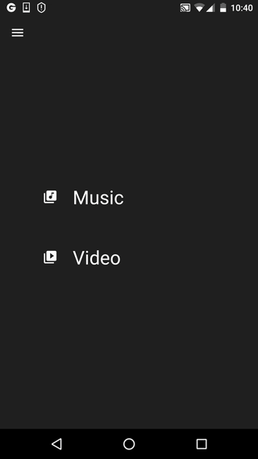

This demo shows an example of how to implement Guillotine menu animation in Android.

It was inspired by an article [here](https://yalantis.com/blog/how-we-created-guillotine-menu-animation/).

I've extended their implementation by adding a number of features:
* Generic interpolators that can work with any bouncing angle and duration
* Landscape mode support
* Animated navigation icon
* Navigation to feature views from the menu view.

